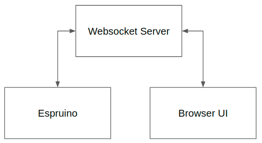

# DeviceRC - Remote Control Your Espruino Over Wifi Via Websockets

## Features
 - Get & set variables 
 - Execute functions, passing in parameters and getting return values
 - Executing new code or overwriting existing on device code
 - Listen for events on the device
 - Setup watchers to monitor variables & functions on the device
 - Rebooting the device

----------------------------------------------



----------------------------------------------

# Websocket Server

## Install NodeJS Server

 1. Download the files in the ```/server``` directory
 2. Update the websocket ```port``` value. By default this is set to 8080. Whatever your value is, make sure the port is open on your firewall.
 3. Run ```npm install```
 4. Run the ```server.js``` under PM2 or your favorite process manager

**Note** - If you can't or don't want to run your own server, feel free to use my shared one at ```wss://shared.robotictheater.com:8080```. Be warned, it comes with no promises or guarantee of uptime.

---------------------------------------------

# Espruino Integration

## Connect To The Websocket Server
Include the device javascript and call ```connect``` passing the following parameters.

**Parameters**
 - sid (required): Your WIFI's SID
 - pwd (required): Your WIFI's password
 - id (required): A unique device id
 - server (required): The websocket server address
 - port (required): The websocket server port
 - disable (optional): An array containing a list of features to disable. Whatever is passed in will be be allowed to be called from the browser.
   - getvariable
   - setvariable
   - function
   - exec
   - reboot
   - watcher

**Callback**
The callback will fire anytime the connection status chnges. It will return True if connected and False if disconnected.

```
let deviceRC = require("https://raw.githubusercontent.com/protoroboticsgit/espruino/master/devicerc/device.min.js").connect({
    "sid":"YOUR-WIFI-SID",
    "pwd":"YOUR-WIFI-PASSWORD",
     "id":"DEVICE-IDENTIFIER",
     "server":"WEBSOCKET-SERVER",
     "port":WEBSOCKET-PORT,
     "disable":[]
},(connected)=>{
  if(connected){
    
  }
});
```

## Firing Events

**Parameters**
 - Event Name: - The name/label of the event that will be referenced in the browsers event listener.
 - Event Value: - The data to record along with the event.

```
deviceRC.event("EVENT-NAME", "EVENT-VALUE")
```

----------------------------------------------

# Browser Setup

## Include Browser JS File

### 1. Include the DeviceRC browser JS file

``` 
@TODO ADD URL HERE
```

### 2. Create a new devivce
You can control multiple devices from the same page. Just create a new object for each device you want to control.
```
let myDevice = Object.create(deviceRC);
```

### 3. Connect to the websocket server

**Parameters**
 - Device Identifier: - An identifier that matches the value entered in your Espurino program.
 - Server: - The address and port for your websocket server.

**Returns**
 - A boolean value. True if connected, False if disconnected.

```
myDevice.connect("DEVICE-IDENTIFIER","ws://YOUR-SERVER:YOUR-PORT").then((connected)=>{
  // ... the rest of your code in here.
});
```

## Browser Methods

### Get On-device Variables

**Parameters**
 - Variable Name: - The name of the variable defined in your Espruino program.

**Returns**
 - The value of the variable.

```
myDevice.variable("VARIABLE-NAME").then(r=>{ console.log(r); });
```

### Set On-device Variables
**Parameters**
 - Variable Name: - The name of the variable defined in your Espruino program.
 - Value: - The new value to set the variable to. Can be any valid type.

**Returns**
 - True if successful. False if the variable does not exist.

```
myDevice.variable("VARIABLE-NAME",VALUE).then(r=>{ console.log(r); });
```

### Call On-device Functions

**Parameters**
 - Function Name: - The name of the function defined in your Espruino program.
 - Arg: (optional) - Whatever is set here will be passed into your function.

**Returns**
 - The return value of the function called.

```
myDevice.function("FUNCTION-NAME", ARG).then(r=>{ console.log(r); });
```

### Execute New Javascript On-device
You can write and execute new JS code on your device from your browser. The code sent DOES NOT persist when the device is rebooted.

**Parameters**
 - Unique ID: - An internal reference for associating the response to the proper request.
 - Code Block: - The JS code to be executed on the Espruino
 
**Returns**
- An empty string on success.  An error message on failure.

```
myDevice.exec("UNIQUE-ID", `CODE-BLOCK`).then(error =>{ console.log(error); });
```

### Register An On-device Watcher
Monitor the value of a variable or function on a specific interval.

**Parameters**
 - Function or Variable Name: - The name of the function or variable present in your Espruino code.
 - Interval: - The number of milliseconds to wait inbetween polling.
 
**Returns**
 - The value of the function or variable

```
myDevice.watcher("FUNCTION-OR-VARIABLE-NAME", INTERVAL).then(r=>{ console.log(r); });
```


### Reboot The Espruino
Allows you to trigger ```E.reboot()``` the the device.

**Parameters**
 - NA
 
**Returns**
 - NA

```
myDevice.reboot();
```


### Ping Espruino
Sends a Ping request to the Espruino, which will respond with a Pong response if it is online.

**Parameters**
 - NA
 
**Returns**
 - NA

```
myDevice.ping();
```

## Browser Events

**NOTE** All events will contain the device identifier in the event.detail data parameter.

### Device Connects
Fires when a device connects the websocket server.

```
window.addEventListener("connect",(evt)=>{
 console.log("connect", evt.detail);
});
```

### Device Disconnects
Fires when a device disconnects from the websocket server.

```
window.addEventListener("disconnect",(evt)=>{
 console.log("connect", evt.detail);
});
```

### Device Pong Response
Fires when the device responds to a Ping request.

```
window.addEventListener("disconnect",(evt)=>{
 console.log("connect", evt.detail);
});
```

### Device Custom Event
Trigger custom events that will respond to on-device events like button presses, sensor triggers or any other IO event.

**Parameters**
 - Event Name: - The event name matching the one set by you Espruino code when triggering the event.

```
window.addEventListener("EVENT-NAME",(evt)=>{
 console.log("connect", evt.detail);
});
```
